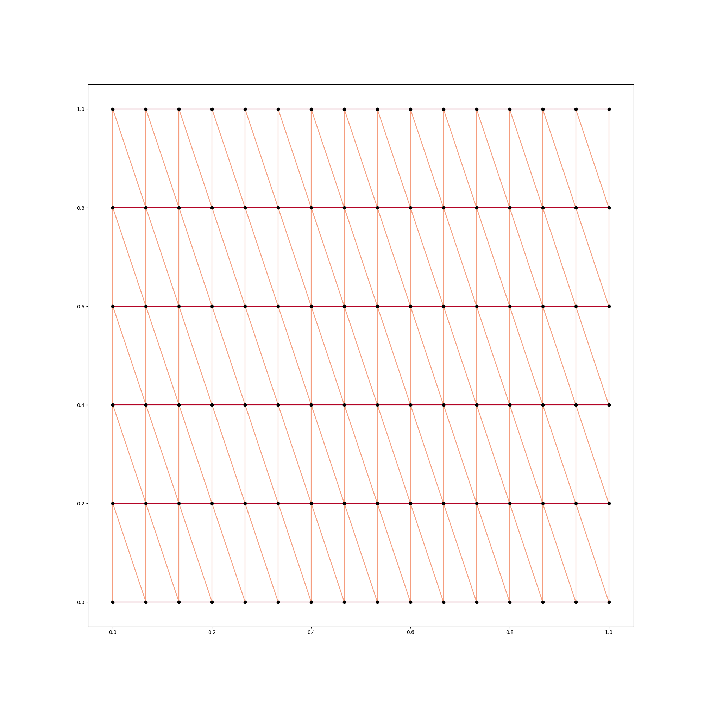

# bounded_domains

This is a small package for computations with and visualizations
for triangulations of polygonal domains.

Basic documentation and further details: https://behackl.dev/tmp/bounded_domains/

